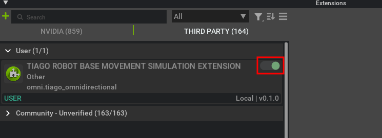

# TIAGo++ Simulation in Isaac Sim

This repository contains a working Isaac Sim simulation of the Pal Robotics TIAGo++ robot with Mecanum wheels. For more detailed technical explanations, please also refer to [our paper (link TODO)].

## Table of Contents
- [Video Demo](#video-demo)
- [Installation and Setup](#installation-and-setup)
    - [Prerequisites](#prerequisites)
    - [Isaac Sim Installation](#isaac-sim-installation)
    - [ROS2 Extensions Setup](#ros2-extensions-setup)
    - [Enabling the TIAGo Omnidirectional Extension](#enabling-the-tiago-omnidirectional-extension)
- [Testing the Simulation](#testing-the-simulation)
    - [Interactive Example Controller](#interactive-example-controller)
    - [Driving via ROS2 Commands](#driving-via-ros2-commands)
    - [Sending Joint Commands](#sending-joint-commands)
- [USD Files Structure](#usd-files-structure)
    - [Robot USD Files](#robot-usd-files)
    - [Example Scenes](#example-scenes)
- [Sensor Data and Visualization (RViz2)](#sensor-data-and-visualization-rviz2)
    - [Visualizing Sensors in RViz2](#visualizing-sensors-in-rviz2)
    - [RGB-D Point Cloud Publishing](#rgb-d-point-cloud-publishing)
- [ROS2 Transform Tree (tf2)](#ros2-transform-tree-tf2)
    - [Visualizing the Transform Tree](#visualizing-the-transform-tree)
    - [Modifying the Transform Tree](#modifying-the-transform-tree)
- [TIAGo Omnidirectional Extension](#tiago-omnidirectional-extension)
    - [Action Graph Nodes](#action-graph-nodes)
- [Technical Background](#technical-background)
- [Authors & Acknowledgments](#authors--acknowledgments)


---

## Video Demo

Here's a demonstration of the simulation in action:

<video width="640" height="360" controls>
  <source src="./video_demo.mp4" type="video/mp4">
  Your browser does not support the video tag.
</video>

---

## Installation and Setup

### Prerequisites

- Ubuntu Linux (recommended: Ubuntu 22.04)
- Python 3.10
- ROS2 Humble
- NVIDIA RTX GPU / any other requirements to run Isaac Sim

### Isaac Sim Installation

1. **Install NVIDIA Isaac Sim**  
   Currently, this simulation requires Isaac Sim version **4.2.0**.

   Follow the official installation guide:  
   [Isaac Sim Installation Guide](https://docs.omniverse.nvidia.com/isaacsim/latest/installation/install_workstation.html)

### ROS2 Extensions Setup

To integrate ROS2 with Isaac Sim, follow this guide carefully:  
[ROS2 Setup for Isaac Sim](https://docs.omniverse.nvidia.com/isaacsim/latest/installation/install_ros.html)

Ensure you source your ROS2 environment properly (example for ROS2 Humble):

```bash
source /opt/ros/humble/setup.bash
```

In this project, we also use a ROS domain ID of 68 everywhere, so make sure to set it:

```bash
export ROS_DOMAIN_ID=68
```

### Enabling the TIAGo Omnidirectional Extension

For the TIAGo simulation to function correctly, you'll need to enable our custom Isaac Sim extension (**omni.tiago_omnidirectional**):

1. **Set the extension search path:**
   - Open Isaac Sim and navigate to `Window → Extensions`.
   - Add the `exts/` folder of this repo to the extension search paths:
   
   


2. **Activate the extension:**
   - Find and enable **omni.tiago_omnidirectional**. To avoid enabling this extension at each start of the application, check the `AUTOLOAD` box as well:
   
   
   

**Important:** If this extension is not enabled, action graphs related to omnidirectional movement won't function, and sending motion commands will have no effect.

### Verification of Successful Setup

To verify your installation, perform these steps:

1. Open one of the provided USD files (`tiago_dual_functional.usd` or `tiago_dual_functional.usd`) in Isaac Sim.
2. Open the action graph named `"ROS2_HolonomicDrive_HeavySimulation"` or `"ROS2_HolonomicDrive_LightSimulation"`:
   
   

If all of these nodes are visible and correctly loaded, your setup should be successful.


## Testing the Simulation

### Interactive Example Controller

We provide a simple interactive Python program (`tiago_example_controller.py`) that allows you to control the TIAGo robot intuitively:

- **Drive** the robot using the keys **W, A, S, D** (forward, left, backward, right).
- **Rotate** the robot using **LEFT** and **RIGHT** arrow keys.
- **Control individual joints** using provided sliders in the GUI.

   

**Dependencies:**

Make sure the following Python dependencies are installed (assuming ROS2 is already installed with `rclpy`):

```bash
pip install tk pyyaml
```

Run the controller with:

```bash
python3 tiago_example_controller.py
```

---

### Driving via ROS2 Commands

The TIAGo robot listens for velocity commands on the ROS2 topic `/cmd_vel`.

- **Set ROS domain ID**:

```bash
export ROS_DOMAIN_ID=68
```

- **Drive forward** example:

```bash
ros2 topic pub /cmd_vel geometry_msgs/msg/Twist "{linear: {x: 1.0, y: 0.0, z: 0.0}, angular: {z: 0.0}}"
```

- **Rotate** example:

```bash
ros2 topic pub /cmd_vel geometry_msgs/msg/Twist "{linear: {x: 0.0, y: 0.0, z: 0.0}, angular: {z: 0.5}}"
```

---

### Sending Joint Commands

The robot also accepts direct joint commands via the ROS2 topic `/joint_command`. 

- **Example:** Lift the torso joint (`torso_lift_joint`) to position `0.5`:

```bash
ros2 topic pub /joint_command sensor_msgs/msg/JointState "{
  header: {stamp: {sec: 0, nanosec: 0}, frame_id: ''},
  name: ['torso_lift_joint'],
  position: [0.5],
  velocity: [],
  effort: []
}" --once
```

To execute smooth joint trajectories, repeatedly publish joint commands at small intervals (Isaac Sim currently lacks native support for smooth trajectory execution).

> **Important:** Always verify that `ROS_DOMAIN_ID` is correctly set to `68` before issuing commands.


## USD Files Structure

The USD files are organized clearly to help you easily choose the appropriate simulation scenario.

### Robot USD Files

- **`tiago_dual_functional.usd`**  
  The primary TIAGo++ simulation file with a physically accurate (heavy) omnidirectional movement simulation.
  
  - Contains custom action graphs for ROS2 integration.
  - Includes simulated sensors (Gemini2 camera, two laser scanners) that publish to ROS2 topics.
  
  > **Important:**  
  > If you prefer a realistic mecanum wheel simulation at the cost of more computational expense, import this file into your environment.

- **`tiago_dual_functional_light.usd`**  
  A computationally lighter version of the TIAGo++ simulation.

  - Inherits from `tiago_dual_functional.usd`.
  - Mecanum wheels are replaced by dummy wheels and the velocity of the robot base is set directly through the Isaac Sim API.

- **`tiago_dual_urdf_imported.usd`** *(Informational Only)*  
  Basic URDF-imported model without functionality.

  - Generated directly by Isaac Sim's URDF importer.
  - Does **not** include custom wheels or simulated sensors.
  - Kept purely for documentation and reference.

---

### Example Scenes

These `.usd` files illustrate how to integrate the robot into simulated environments:

- **`example_scene.usd`**  
  A generic scene without robot integration. Useful as a base scene.

- **`example_scene_heavy.usd`**  
  Integrates:
  - `example_scene.usd`
  - `tiago_dual_functional.usd`
  
  Provides optimized physics simulation parameters ideal for realistic, computationally intensive simulations:

  

  > **Note:**  
  > Physics parameters (e.g., "Time Steps Per Second") are tuned according to best practices established by Fraunhofer's O3dyn simulation. Adjusting these settings affects simulation accuracy and computational load.

- **`example_scene_light.usd`**  
  Integrates:
  - `example_scene.usd`
  - `tiago_dual_functional_light.usd`

  Uses standard physics parameters with fewer time steps per second; Suitable faster and less computationally demanding simulations, at the cost of less accurate behavior due to no ground contact simulation.

---


## Sensor Data and Visualization (RViz2)

### Visualizing Sensors in RViz2

The simulation publishes data from onboard sensors such as:

- RGB-D camera (Gemini2)
- Two laser scanners
- TF transform tree

To visualize this data:

1. Launch `rviz2`.
2. Load the provided RViz configuration file:

```bash
rviz2 -d tiago_minimal_rviz.rviz
```

---

### RGB-D Point Cloud Publishing

Isaac Sim (version 4.2.0) does not publish RGB point clouds directly. Instead, it publishes:

- RGB image
- Depth image

We provide a custom ROS2 node to convert these into an RGB point cloud.

#### Instructions:

```bash
# Build the workspace (if not already built)
cd ros2_ws/
colcon build
cd ..
source ros2_ws/install/setup.bash

# Launch the RGB point cloud node
ros2 launch tiago_rviz2 rgb_pointcloud.py
```

Once launched, this node publishes an RGB point cloud to the topic:

```text
/gemini2/rgbpoints
```

You can then visualize the RGB point cloud directly in RViz2.

> **Note:** Ensure that the ROS domain ID is set to `68` when running RViz2 and the conversion node:

```bash
export ROS_DOMAIN_ID=68
```


## ROS2 Transform Tree (TF2)

### Visualizing the Transform Tree

The robot's transform tree is published to the `/tf` topic while the simulation is running.

To generate a visual PDF of the current TF tree:

```bash
ros2 run tf2_tools view_frames
```

This will generate a file named `frames.pdf` that shows the full transform hierarchy of the TIAGo robot.

We’ve also included a pre-generated version for reference:

```
screenshots/tf_visualization_of_tiago_dual_functional.pdf
```

---

### Modifying the Transform Tree

If you modify the robot (e.g., adding new parts), you need to ensure the TF tree is still published correctly.

#### Action Graph: `ROS_TF_ODOM`

We manually publish the transforms of all relevant robot parts in this action graph. This is necessary because:

- Isaac Sim supports **automatic TF publishing**, but it includes *all* links—this caused severe **RViz2 performance issues** due to the many small rollers on the mecanum wheels.
- We **exclude the wheels** and only publish important transforms manually.

You can learn more about automatic TF publishing here:  
[Isaac Sim: ROS TF Tutorial](https://docs.omniverse.nvidia.com/isaacsim/latest/ros_tutorials/tutorial_ros_tf.html)

---


## TIAGo Omnidirectional Extension

The custom extension located in the `exts/omni/tiago_omnidirectional` folder enables omnidirectional movement for the TIAGo++ robot in Isaac Sim.

This extension adds support for Omnidirectional base control of the Tiago robot with realistic S-shaped velocity profiles learned from the real robot.

### Action Graph Nodes

The extension implements two custom **Action Graph nodes**:

1. **OgnTiagoWheelVelocityCalculator**


   - Calculates the conversion from the Twist movement command into target wheel velocities for the four wheels.
2. **OgnOmnidirectionalVelocityController**


   - Computes velocity profiles that simulate realistic acceleration behavior.
   - If the heavy simulation is enabled (uncheck *directlySetVelocity*), it returns the current velocity of the base as computed due to the fitted velocity profile. You then need to feed this velocity into an *OgnTiagoWheelVelocityCalculator* node.
   - If the light simulation is enabled (check *directlySetVelocity*) it immediately sets the robot base velocity according to the velocity profile.
   In this case, the output (*angularZ*, *linearX*, *linearY*) is irrelevant.
   

---


## Technical Background

> This section is optional for users who just want to run the simulation.  
> However, it may be helpful for those who want to simulate other robots or understand the internals.  
> For more detailed explanations, please refer to [our paper (TODO link)].

Getting the TIAGo++ robot to work with realistic omnidirectional movement in Isaac Sim required multiple modifications and design decisions.

#### 1. URDF Import

- We began by importing the official TIAGo++ URDF into Isaac Sim using the built-in URDF importer.
- The original URDF model was only intended for use in Gazebo and included fixed (non-functional) rollers on the mecanum wheels.

#### 2. Method of Related Work

- In Gazebo, Pal Robotics simulated the mecanum wheels using an approximation plugin—not full physical simulation.
- We studied Fraunhofer’s O3dyn project, which **accurately simulates mecanum wheels** by:
  - Attaching each roller via revolute joints.
  - Adding collision spheres to each roller for contact approximation.

  Reference:  
  [Fraunhofer GitHub Repository](https://git.openlogisticsfoundation.org/silicon-economy/simulation-model/o3dynsimmodel)  
  [Presentation by Marvin Wiedemann](https://vimeo.com/879001799/0e54e12495)

#### 3. Building a New Wheel

- We replaced the original fixed wheels with realistic ones based on the open-source repo:  
  [fuji_mecanum (by DaiGuard)](https://github.com/DaiGuard/fuji_mecanum)
- We modified this wheel model to:
  - Reduce unnecessary detail; Reducing the number of polygons.
  - Add collision spheres for better physics interactions.

#### 4. Learning the Velocity Profile

- Even with physically accurate wheels, the simulated acceleration behavior differed from the real robot.
- Fine-tuning Isaac Sim's PID controllers was not enough to achieve realistic motion.
- Instead, we:
  - Systematically collected simple acceleration profiles from the real TIAGo robot.
  - Trained to predict a smooth **S-shaped velocity function** to approximate its response for any given target wheel velocity.
  - Integrated this learned model into our Isaac Sim extension (`omni.tiago_omnidirectional`) to set wheel velocities realistically.

---

### Summary

The final result is a hybrid system combining:
- Accurate physical modeling of mecanum wheels.
- Realistic motion control using learned profiles.
- Full integration with ROS2 for control and sensor feedback.


---

## Authors & Acknowledgments

This project was developed at the **AIS Robotics Lab**, University of Bonn, with main author *Vincent Schönbach* (Email: [vschoenb (at) uni-bonn.de])

### Acknowledgments
- This work builds on the efforts of the Pal Robotics team (TIAGo robot).
- Inspiration for the mecanum simulation approach comes from Fraunhofer’s O3dyn project.
- Mecanum wheel models adapted from the open-source project [fuji_mecanum](https://github.com/DaiGuard/fuji_mecanum) by DaiGuard.

We thank the broader Isaac Sim and ROS2 communities for their excellent tools and documentation.

